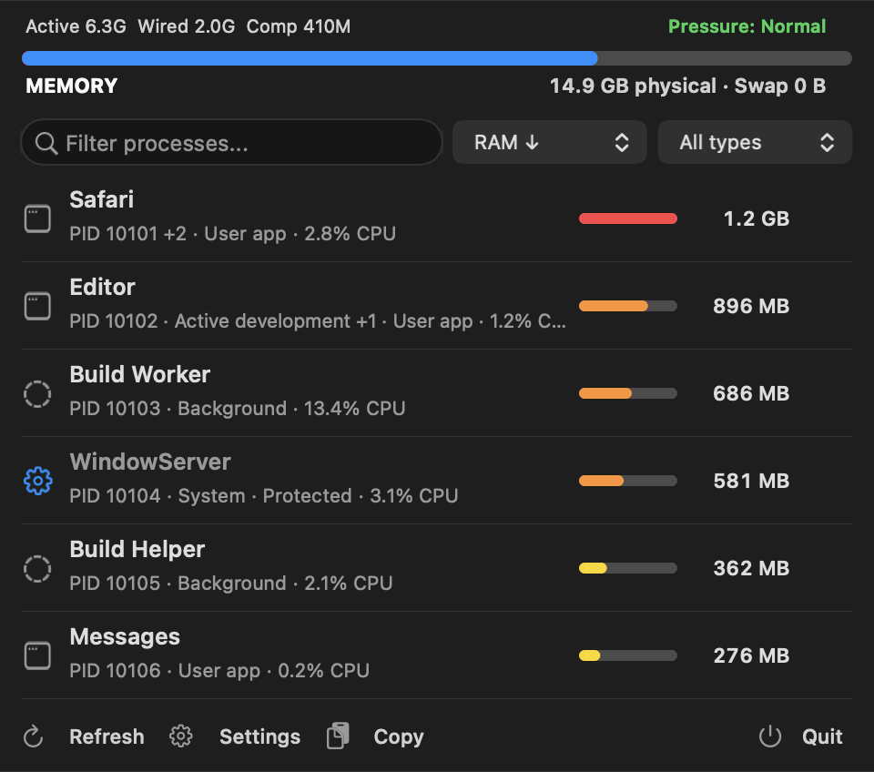
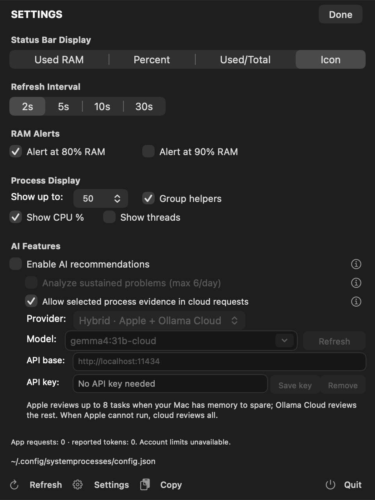

# System Processes

System Processes is a native macOS menu bar app for inspecting apps and background tasks. See what uses memory, review who owns each task and what it has been doing, then decide whether to stop it.

## Install from source

Requires macOS 13 or later and an Apple Swift toolchain with the macOS SDK. The build targets your Mac's current architecture. If Swift is not available, install Apple's Command Line Tools with `xcode-select --install`.

```bash
git clone https://github.com/Nebulazer123/SystemProcesses.git
cd SystemProcesses
bash build.sh
open SystemProcesses.app
```

The build checks for Apple's Foundation Models macro plugin. Without it, the core app and cloud providers still build, while Apple on-device analysis is disabled. Apple on-device analysis needs macOS 26 or later, a compatible system model, and a toolchain with the macro plugin.

## Set it up with an AI coding agent

Copy this prompt into a coding agent running on your Mac:

```text
Set up System Processes on this Mac.

Clone https://github.com/Nebulazer123/SystemProcesses.git, build it with `bash build.sh`, and run its regression checks with `bash script/test.sh`. Launch the built app and verify that its menu bar button opens the popup and that clicking outside or pressing Escape closes it. If you cannot inspect the menu bar or popup on this Mac, tell me instead of claiming that step passed.

Install it in /Applications with a recoverable backup if a copy is already there. Preserve my existing app and preferences; do not replace anything unless you can restore it.

If my request explicitly asks you to set up cloud AI, use the default Hybrid route after explaining that selected process details go to Ollama Cloud. Hybrid first uses Apple on-device analysis for up to eight processes when memory pressure is normal and the model is available, then sends the rest to the selected Ollama Cloud model. With warning, critical, or unavailable pressure, or when Apple is unavailable, Ollama Cloud reviews all candidates. A fresh setup already has cloud sharing ready, so do not ask for separate confirmation just to enable that setting. If saved settings show cloud sharing is off, preserve that choice and stop before online inference; do not turn it back on. Apple on-device is an optional local-only mode.

Before the first cloud analysis, tell me that Ollama Cloud receives selected process names and IDs, resource readings, owner labels, and activity or memory-growth signals; full paths, command lines, environment variables, and private files are excluded. Ask me to sign in to Ollama if needed, and before saving an API key or using a provider that may charge me. Do not buy credits or import credentials from another app or subscription. Do not download third-party model weights. Never stop a process automatically; process stops must remain my choice.

Report which build, regression, popup, and installation steps you actually completed, and any steps you could not verify.
```

## See and use the popup



*Illustrative process names, readings, and identities are synthetic.*

Click the menu bar button to open the popup. Search the list, then select a row to review its owner, age, activity, parent, and observed memory growth. These details help with investigation; they do not prove that a task is safe to stop or abandoned. History stays in memory, is bounded, and can cover up to an hour. Observed growth is not proof of a leak.


In icon mode, click the button again, click outside the popup, or press Escape to close it. The overview reports macOS memory pressure separately from its bar, which represents non-free physical pages.

## What you can do

- **Review context.** Search processes and see their current resource use alongside ownership and recent behavior.
- **Protect work.** **Protect** blocks stop controls for an executable. **Ignore AI** excludes it from recommendations; it does not protect the process from a manual stop.
- **Stop by choice.** A graceful stop needs confirmation. A force stop becomes available only after that attempt and needs its own confirmation. A grouped row targets only its displayed parent. AI never stops processes.
- **Use your own AI service.** Enabling AI looks up models for Hybrid, Ollama Cloud, or Apple on-device; use **Refresh** for later checks and other providers. OpenAI, Anthropic, DeepSeek, xAI, OpenRouter, and custom compatible endpoints use your API key, saved in macOS Keychain.
- **Choose how much automation to use.** AI recommendations are optional. Automatic analysis is off until enabled and is limited to six requests a day with a ten-minute cooldown. Its history is local; if that history cannot be read or saved, automatic analysis pauses.

## AI choices and settings

AI recommendations and automatic analysis start off. A fresh setup selects Hybrid with an Ollama Cloud model and has cloud sharing ready for when you enable AI. Hybrid uses the selected Ollama Cloud model for online analysis. Choose **Apple on-device** for local-only analysis; its availability depends on macOS, the build toolchain, and the system model. Both modes only recommend actions. Read [AI provider setup and data details](docs/ai-providers.md) to see what cloud analysis sends and how existing sharing preferences are handled.



The three information buttons explain AI recommendations, automatic analysis, and cloud process evidence in plain language. The [user guide](docs/guide.md) covers process details, stop controls, readings, and build troubleshooting.

## Help and license

Report reproducible issues at [GitHub Issues](https://github.com/Nebulazer123/SystemProcesses/issues), or report vulnerabilities privately using the [security policy](SECURITY.md). See [CONTRIBUTING.md](CONTRIBUTING.md) for the build and regression-check workflow. System Processes is available under the [MIT License](LICENSE).
